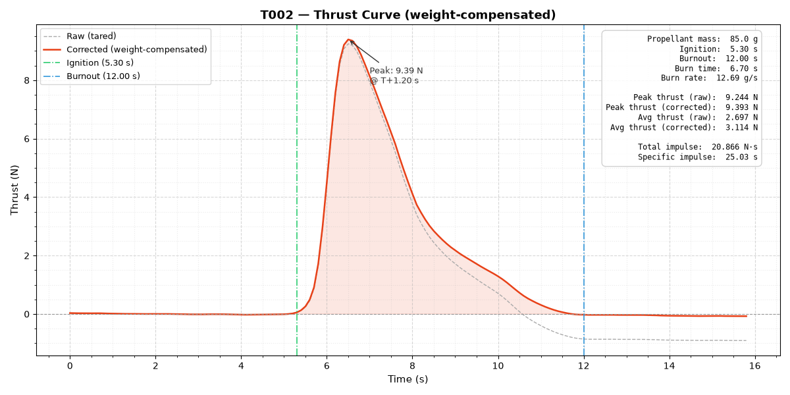

# HomiS II - T002
Propellant made: 27/06/2026 1100hrs

Batch tested: 29/06/2026 1120hrs

Propellant: KNSU with Aluminium and Ferric Oxide

Casing: Metal Reusable

## About T002

As we failed to record the thrust curve of T001, everything was kept same as T001 and an improved testing rig was used.

## Pre-test Rational

The rational behind this test was our previous test was inconclusive as our testing rig failed to record any data. The Electronics team developed an improved testing rig prior to T002, with which would properly characterise our best formulation.

## Post-test Understadning

The testing rig worked succesfully and we generated a thrust curve and performed an analysis with Python. With the data collected, T002 was characterised as a D3 class motor. We are aiming for an E5 class motor for HomiS II, hence we are aiming to increase the total impulse and average thrust. We will do so by iterating one variable at a time.