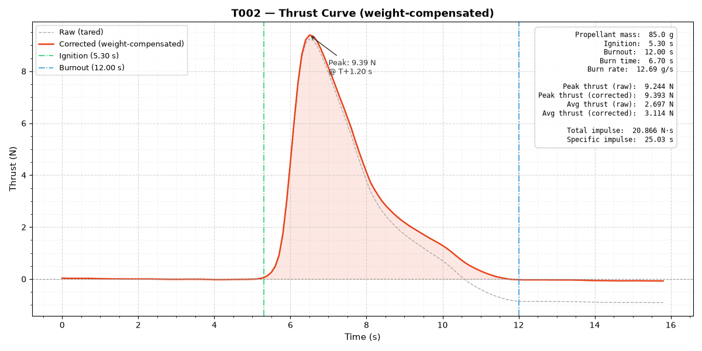

# T002 — First thrust curve

| | |
|---|---|
| Propellant made | 2026-06-27, 11:00 |
| Tested | 2026-06-29, 11:20 |
| Propellant | KNSU with aluminium and ferric oxide. 85 g loaded (handwriting unclear) |
| Casing | Reusable metal casing, M-Seal and metal nozzle, forward closure. OD 34.3 mm, ID 25.8 mm, IL 127.7 mm, mass 619.45 g |
| Nozzle | 4 mm |
| Result | **D3.** First characterised motor. |

## Formulation

Same as T001. From the [log sheet](T002.pdf):

| Chemical | Mass (g) | Vendor |
|---|---|---|
| Potassium nitrate (KNO₃) | 65 | ACS Chemicals |
| Sucrose | 27 | Whole Farm |
| Aluminium, 325 mesh | 5 | Chemco (Chemdyes Corporation) |
| Ferric oxide (Fe₂O₃) | 3 | Chemco (Chemdyes Corporation) |

## Why

T001 was inconclusive because the rig recorded nothing. We kept everything else the same and used the Electronics team's improved rig.

## What happened

The rig worked. We got a full thrust curve, analysed it in Python, and characterised the motor as a **D3**. HomiS II needs an E5, so total impulse and average thrust both have to rise. From here we change one variable at a time.

## Files

- `T002.pdf`: scanned log sheet
- `T002.csv`: thrust data · `T002.png`: analysis
- `T002.mov`: video
