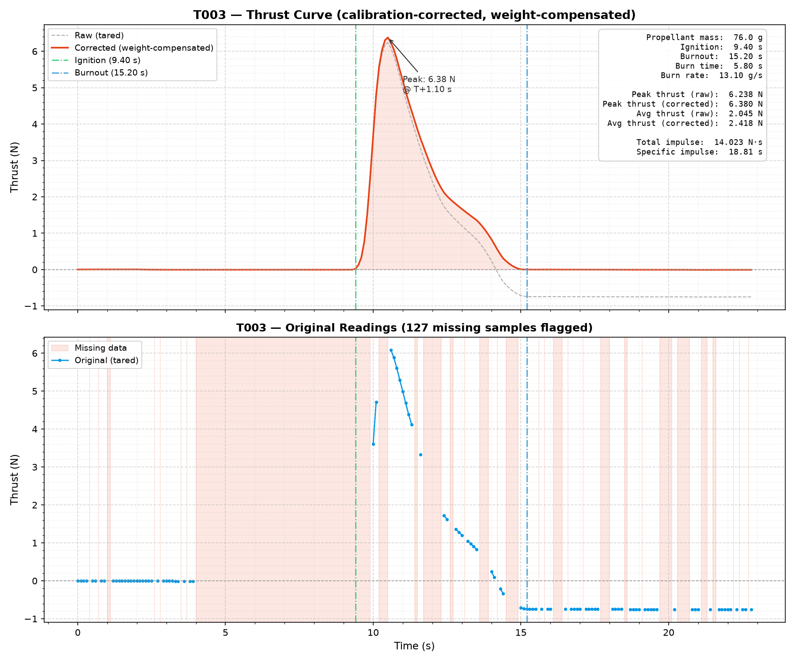

# HomiS II - T003
Propellant made: 02/07/2026 1330hrs

Batch tested: 03/07/2026 0930hrs

Propellant: KNSU with Aluminium and Ferric Oxide

Casing: Metal Reusable

## About T003

We aimed to recreate T002 so that we could reliably characterise our formulation.

## Pre-test Rational

The rational behind this test was to fully replicate T002 so that we could be sure of our ability to reliably make propellants. To continue research and development, we wanted to change just 1 parameter(smaller nozzle size) to see possible disparities in the thrust curveю

## Post-test Understadning

The testing rig worked partially and we received fragmented data. Refering to the T002 thrust curve shape, we used Opus 4.8 to fill in the missing data, generated two thrust curves and performed an analysis with Python. With the data collected, T003 was characterised as a D2 class motor. This was quite disappointing and we condcluded that the sub-expected output was due to procedural failures during the making of this batch. 