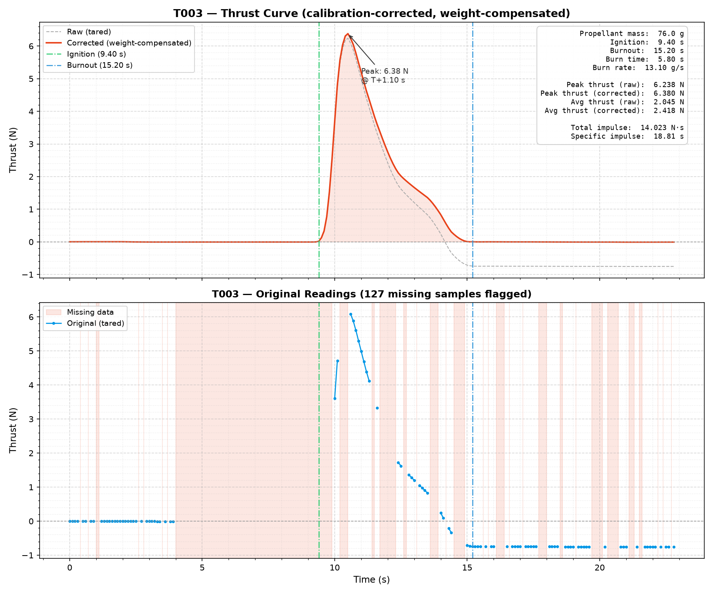

# T003 — Smaller nozzle

| | |
|---|---|
| Propellant made | 2026-07-02, 10:30 |
| Tested | 2026-07-03, 09:30 |
| Propellant | KNSU with aluminium and ferric oxide. 76 g loaded |
| Casing | Reusable metal casing, M-Seal and metal nozzle, forward closure. OD 34.3 mm, ID 25.8 mm, IL 127.7 mm |
| Nozzle | 2 mm (down from 4 mm) |
| Result | **D2**, from partial data |

## Formulation

T002 re-weighed more precisely. From the [log sheet](T003.pdf):

| Chemical | Mass (g) | Vendor |
|---|---|---|
| Potassium nitrate (KNO₃) | 65.3 | ACS Chemicals |
| Sucrose | 26.98 | Whole Farm |
| Aluminium, 325 mesh | 5.05 | Chemco (Chemdyes Corporation) |
| Ferric oxide (Fe₂O₃) | 2.9 | Chemco (Chemdyes Corporation) |

## Why

We wanted to replicate T002 to confirm we could make the propellant reliably, and change one parameter (a smaller nozzle) to see how the thrust curve moved.

## What happened

The rig recorded fragmented data. We filled the gaps with Claude Opus 4.8, using T002's curve shape as a reference, and analysed both versions. The result was a **D2**, below T002. We think the batch suffered from procedural errors during the cook.

> **Gap-filled data.** `T003O.csv` is the original recording, with missing samples logged as `0.00`. `T003R.csv` is the repaired version, and some of its values are AI-generated, not measured. Numbers from T003 are less reliable than T002's.

## Files

- `T003.pdf`: scanned log sheet
- `T003O.csv`: original data · `T003R.csv`: gap-filled data · `T003.png`: analysis
