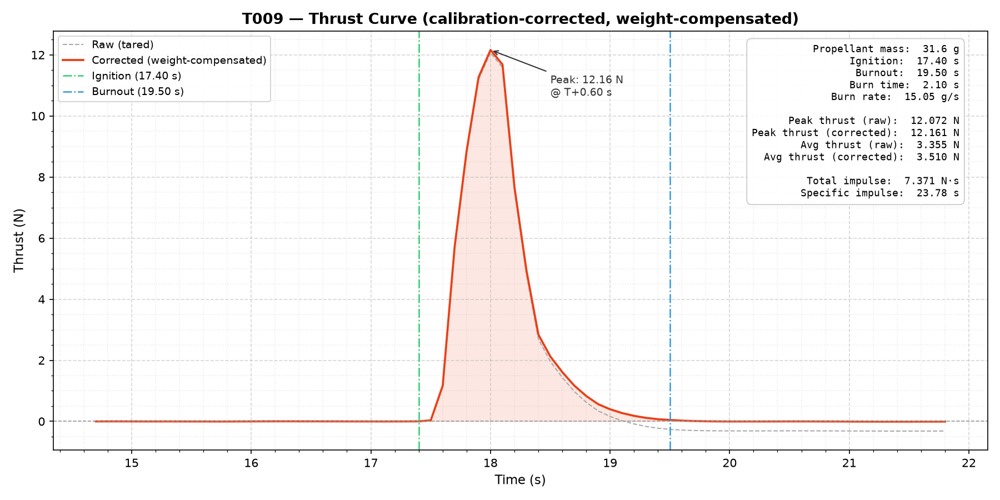

# T009

| | |
|---|---|
| Propellant made | Unrecorded |
| Tested | Unrecorded |
| Propellant | Unrecorded. 31.6 g loaded |
| Casing | Unrecorded |
| Result | **C-class**: 7.37 N·s total impulse |

Only the thrust data and analysis were committed. The formulation, casing and reasoning for this test weren't written down.

## Results

From the analysis in `T009.png`:

| | |
|---|---|
| Burn time | 2.10 s |
| Peak thrust | 12.16 N at T+0.60 s |
| Average thrust | 3.51 N |
| Total impulse | 7.37 N·s |
| Specific impulse | 23.8 s |

Reproduce the analysis from this folder with `python ../../../Resources/TestAnalysis/main.py T009 17.4 19.5 0.0316`.
