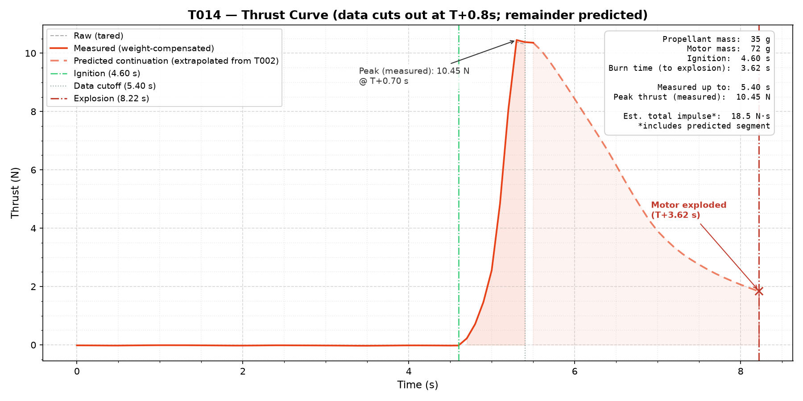

# T014

| | |
|---|---|
| Propellant made | Unrecorded |
| Tested | Unrecorded |
| Propellant | Unrecorded. 35 g loaded |
| Motor mass | 72 g |
| Result | **Motor exploded** at T+3.62 s. Partial data. |

Only the data and analysis were committed. The formulation, casing and reasoning for this test weren't written down.

## What happened

The motor burned for 3.62 s and then exploded. Data acquisition cut out at T+0.8 s, just after the thrust peaked at about 10.4 N.

> **Predicted data.** Everything in `T014.png` after the data cutoff is extrapolated from T002's decay curve, not measured. The total impulse on the plot includes that predicted segment.

## Files

- `T014.csv`: thrust data (to T+0.8 s)
- `T014_plot.py`: one-off analysis that extrapolates past the cutoff. It reads `../T002/T002.csv`.
- `T014.png`: its output
